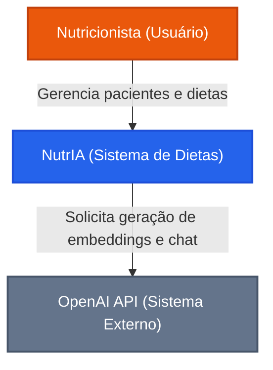
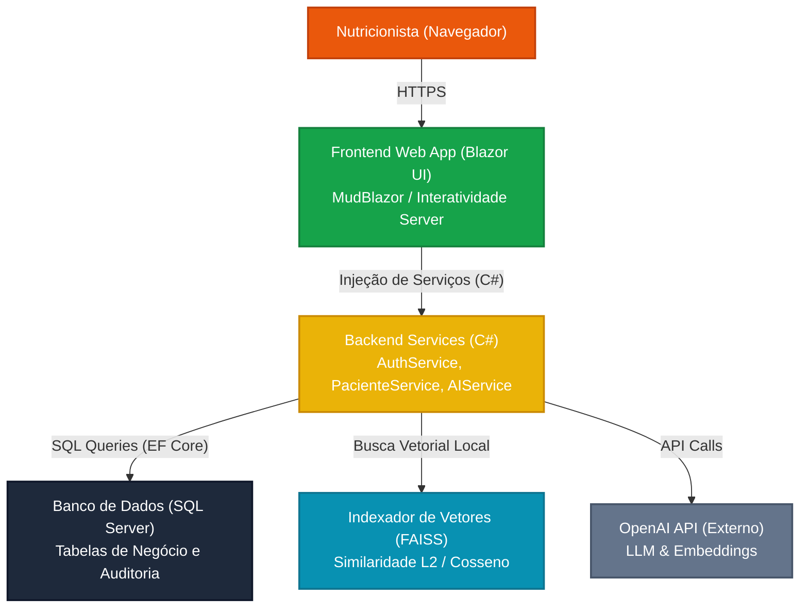

# NutrIA — Sistema Web de Dietas Personalizadas com IA

O **NutrIA** é um assistente inteligente e plataforma web integrada para nutricionistas. Ele auxilia na criação, acompanhamento e ajuste de dietas personalizadas através de Inteligência Artificial baseada em LLM (**Large Language Models**) e arquitetura **RAG** (**Retrieval-Augmented Generation**), garantindo segurança dos dados e rastreabilidade conforme a **LGPD**.

Este projeto foi desenvolvido como Portfólio de Conclusão de Curso (TCC) em Engenharia de Software no **Centro Universitário Católica de Santa Catarina**.

---

## 🚀 Funcionalidades Principais

*   **Autenticação Segura (JWT):** Controle de acessos robusto via JSON Web Tokens armazenados em cookies criptografados e seguros (`HttpOnly`, `Secure`, `SameSite.Strict`).
*   **Gestão de Pacientes (CRUD):** Cadastro completo, acompanhamento clínico de sessões, evolução de medidas antropométricas e restrições alimentares.
*   **Geração Inteligente de Planos Alimentares:** Aceleração do trabalho do nutricionista por meio de geração estruturada de refeições com suporte do GPT-4o-Mini da OpenAI.
*   **Assistente Clínico IA (RAG com FAISS):** Chat contextualizado que "conversa" com o histórico clínico do paciente. As respostas da IA incluem citações precisas de fontes (ex: `[Sessoes:14]` ou `[Planos_Dieta:2]`).
*   **Conformidade com a LGPD:** Ocultação de dados sensíveis e pessoais (Nome, Email, Telefone) de pacientes antes do processamento pela IA, com fluxo de consentimento explícito.
*   **Auditoria de IA:** Registro imutável de todas as consultas feitas ao LLM, incluindo latência, termos LGPD, chunks vetoriais recuperados e fontes citadas.
*   **Modo Escuro (Dark Mode):** Interface adaptável baseada no MudBlazor com suporte a troca rápida de tema claro e escuro.

---

## 🏛️ Arquitetura do Sistema (C4 Model)

De acordo com o RFC do projeto, o sistema utiliza o padrão arquitetural **MVC** expandido por uma **Camada de Serviços** para desacoplamento de persistência, e integra-se à API da OpenAI via RAG local com a biblioteca FAISS.

### Nível 1: Diagrama de Contexto



### Nível 2: Diagrama de Containers



---

## 🛠️ Tecnologias Utilizadas

*   **Backend:** ASP.NET Core 8.0 & Web API
*   **Frontend:** Blazor Interactive Server & MudBlazor UI Component Library
*   **Persistência (ORM):** Entity Framework Core 8 com SQL Server
*   **Busca Vetorial:** `FaissMask` (wrapper .NET para FAISS - Facebook AI Similarity Search) & `System.Numerics.Tensors`
*   **Segurança:** Criptografia de senhas com `BCrypt.Net-Next` e tokens JWT (`Microsoft.AspNetCore.Authentication.JwtBearer`)
*   **Testes:** xUnit, Moq, EF Core InMemory DB
*   **Documentação OpenAPI:** Swagger/Swashbuckle

---

## ⚙️ Configuração do Ambiente e Instalação

### Pré-requisitos
*   [.NET 8.0 SDK](https://dotnet.microsoft.com/download/dotnet/8.0) instalado.
*   [Docker](https://www.docker.com/) e Docker Compose instalados (caso opte por rodar em containers).
*   Chave de API da OpenAI ativa.

### Variáveis de Ambiente necessárias
Configure as variáveis a seguir no arquivo `appsettings.json` ou no seu sistema operacional:
*   `OPENAI_API_KEY`: Sua chave privada da OpenAI (ex: `sk-proj-...`).
*   `JWT_SECRET_KEY`: Chave simétrica usada para assinar os tokens JWT (mínimo 32 caracteres).

---

### Execução via Docker (Recomendado)

O projeto está totalmente configurado para subir a aplicação e o banco de dados SQL Server de forma isolada via containers Docker:

1. Suba os containers com o comando:
   ```bash
   docker-compose up --build -d
   ```
2. A aplicação estará disponível localmente em: `http://localhost:8080`
3. A documentação interativa do Swagger estará disponível em: `http://localhost:8080/swagger`

---

### Execução Local Convencional

1.  **Restaurar Pacotes e Compilar:**
    ```bash
    dotnet restore
    dotnet build
    ```
2.  **Configurar Banco de Dados:**
    Ajuste a Connection String no arquivo `appsettings.json`. Em seguida, execute as Migrations para criar a estrutura de tabelas:
    ```bash
    dotnet ef database update
    ```
3.  **Executar o Projeto:**
    ```bash
    dotnet run --project NutriFlow.csproj
    ```

---

## 🧪 Executando os Testes Automatizados

O projeto conta com testes unitários cobrindo o fluxo de criptografia de senhas, claims JWT e a conformidade do RAG com as regras da LGPD (pseudonimização de chunks).

Para rodar a suite de testes, execute:
```bash
dotnet test
```

---

## 📑 Documentação da API (Endpoints Versionados)

Todas as rotas públicas de integração de dados do NutrIA são versionadas como `v1`:

### Autenticação
*   `POST /api/v1/auth/login`: Realiza o login do nutricionista validando a senha via BCrypt e anexa o Cookie seguro de JWT.
*   `GET /api/v1/auth/logout`: Remove o Cookie JWT limpando a sessão.

### Assistente IA & RAG
*   `POST /api/v1/assistente/query`: Executa o pipeline RAG. Recebe a pergunta e o ID do paciente, realiza a busca semântica no FAISS, pseudonimiza os dados clínicos e obtém a resposta da IA com citações de fontes. *(Protegido por Rate Limiting: máx 10 req/min)*.
*   `GET /api/v1/assistente/audit/{pacienteId}`: Recupera a lista de logs de auditoria de consultas da IA relativos ao paciente, restrito ao nutricionista proprietário da sessão.
*   `GET /api/v1/assistente/metricas`: Devolve dados estatísticos agregados de uso (latência média, quantidade de buscas, etc.) do usuário logado.

---

## ⚖️ Licença

Este projeto é de uso acadêmico sob os termos da licença MIT. Consulte o arquivo `LICENSE` para mais detalhes.